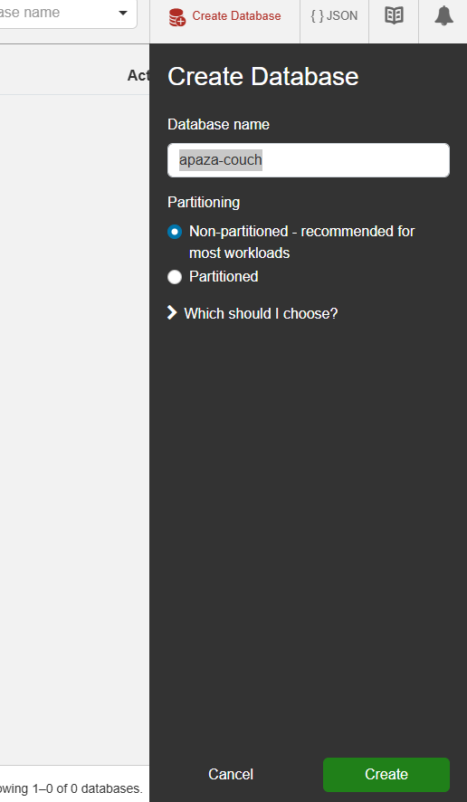

# Introducción
albert apaza ccalle 2021071075
# Introducción

CouchDB es una base de datos NoSQL orientada a documentos que utiliza un formato JSON para el almacenamiento de datos. Su arquitectura está diseñada para la flexibilidad y la facilidad de uso, permitiendo a los desarrolladores almacenar datos de manera natural y sin esquema.

## ¿Por qué elegir CouchDB?

Elegir CouchDB puede ser beneficioso por varias razones, especialmente dependiendo de las necesidades específicas de tu aplicación. Aquí hay algunas razones clave para considerar CouchDB:

1. **Diseño sin esquema**
2. **API HTTP/RESTful**
3. **Control de concurrencia de múltiples versiones (MVCC)**
4. **Replicación integrada**
5. **Capacidades fuera de línea**
6. **Escalabilidad**
7. **MapReduce para consultas**
8. **Almacenamiento orientado a documentos**
9. **Fuerte soporte comunitario**
10. **Integración con otras herramientas**

## Repositorio de GitHub

[Repositorio de CouchDB en GitHub](https://github.com/AlbertApaza/COACH_NOSQL)

## 1. Clonar el Repositorio

Si deseas trabajar en el repositorio localmente, puedes clonarlo usando Git. Abre tu terminal y ejecuta:

```bash
git clone https://github.com/AlbertApaza/COACH_NOSQL.git
```
# Comenzando

## Paso 1: Requisitos del Sistema

CouchDB puede ejecutarse en varias plataformas, incluyendo:

- **Windows**
- **macOS**
- **Linux** (varias distribuciones)

## Paso 2: Descargar CouchDB

Visita la [Página Oficial de CouchDB](https://couchdb.apache.org/#download) y elige la versión apropiada para tu sistema operativo:

- **Windows**: Descarga el instalador `.exe`.
  
- **macOS**: Descarga el archivo `.dmg` o usa Homebrew con el comando:

    ```bash
    brew install couchdb
    ```

- **Linux**: Puedes encontrar instrucciones de instalación para diferentes distribuciones como Ubuntu, Debian, Fedora, etc. A menudo puedes usar administradores de paquetes como `apt` o `yum`.

    ```bash
    sudo apt-get update 
    sudo apt-get install couchdb
    ```

## Paso 3: Instalación (Windows)

Cuando ejecutes el instalador de CouchDB, la parte más importante es cuando se te pida crear un usuario y una contraseña. Asegúrate de validar las credenciales que ingresas antes de continuar con la instalación, ya que las necesitarás para acceder a la interfaz de administración de CouchDB.


## Paso 4: Verificar Servicios CouchDB (Windows)

Abre la aplicación Servicios buscando "Servicios" en el menú de inicio. Busca "Apache CouchDB" en la lista y verifica su estado. Debería decir "En ejecución".


## Paso 5: Probar CouchDB (Windows)

Abre un navegador web y ve a: http://127.0.0.1:5984/


Deberías ver una respuesta JSON similar a esta:

```json
{
  "couchdb": "Welcome",
  "version": "3.4.2",
  "git_sha": "6e5ad2a5c",
  "uuid": "7e642960924137615117055a53c5f227",
  "features": [
    "access-ready",
    "partitioned",
    "pluggable-storage-engines",
    "reshard",
    "scheduler"
  ],
  "vendor": {
    "name": "The Apache Software Foundation"
  }
}
```
# Guía de Instalación y Configuración de CouchDB

## Paso 6: Crear Base de Datos


## Paso 7: Crear la Estructura del Proyecto

### Estructura del Directorio del Proyecto
Crea una carpeta para tu proyecto, por ejemplo, `couchdb_project`. Dentro de esta carpeta, crea la siguiente estructura:
couchdb_project/ ├── db.php ├── index.php └── styles.css

### Configuración de CouchDB

```php
define('COUCHDB_HOST', '127.0.0.1');
define('COUCHDB_PORT', '5984');
define('COUCHDB_DB', 'apaza-couch'); // Nombre de la base de datos
define('COUCHDB_USER', 'admin'); // Nombre de usuario
define('COUCHDB_PASSWORD', '1234'); // Contraseña


### Función para Hacer Solicitudes HTTP con Autenticación

```php
function couchdb_request($method, $url, $data = null) {
    $ch = curl_init();
    curl_setopt($ch, CURLOPT_URL, $url);
    curl_setopt($ch, CURLOPT_RETURNTRANSFER, true);
    curl_setopt($ch, CURLOPT_CUSTOMREQUEST, $method);
    curl_setopt($ch, CURLOPT_USERPWD, COUCHDB_USER . ':' . COUCHDB_PASSWORD);

    if ($data) {
        curl_setopt($ch, CURLOPT_POSTFIELDS, json_encode($data));
        curl_setopt($ch, CURLOPT_HTTPHEADER, array('Content-Type: application/json'));
    }

    $response = curl_exec($ch);
    $code = curl_getinfo($ch, CURLINFO_HTTP_CODE);
    curl_close($ch);

    return ['body' => json_decode($response, true), 'code' => $code];
}

### Crear una Tarea para un Usuario
```php
function create_task($user_id, $title, $description) {
    $document = [
        'user_id' => $user_id,
        'title' => $title,
        'description' => $description,
        'status' => 1, // 1 = visible
        'created_at' => date('Y-m-d H:i:s')
    ];

    $task_id = strtolower($user_id . '_' . str_replace(' ', '_', $title));
    return couchdb_request('PUT', "http://" . COUCHDB_HOST . ":" . COUCHDB_PORT . "/" . COUCHDB_DB . "/" . $task_id, $document);
}

### Recuperar Todas las Tareas y Usuarios
```php

function get_all_users_tasks() {
    $url = "http://" . COUCHDB_HOST . ":" . COUCHDB_PORT . "/" . COUCHDB_DB . "/_all_docs?include_docs=true";
    return couchdb_request('GET', $url);
}
### resultado

